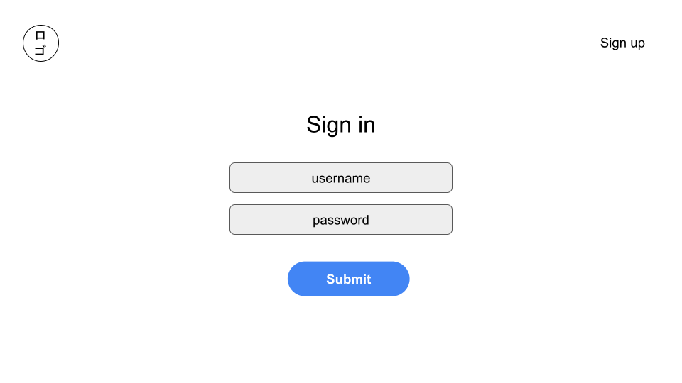
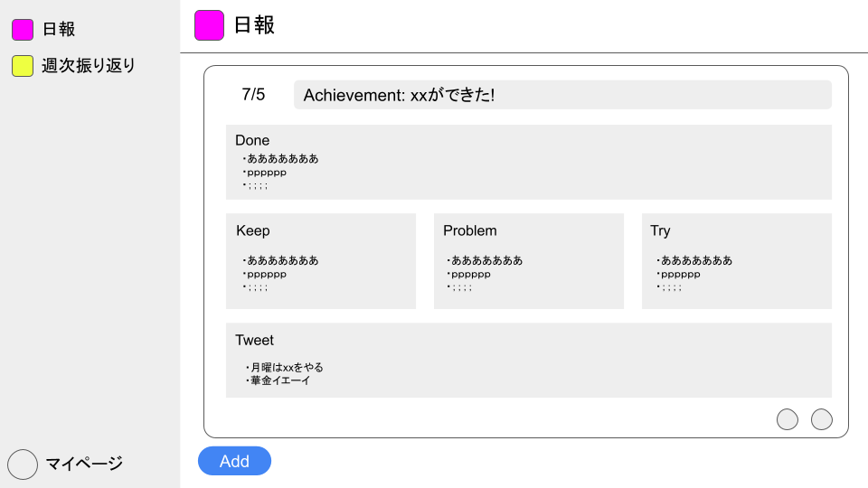
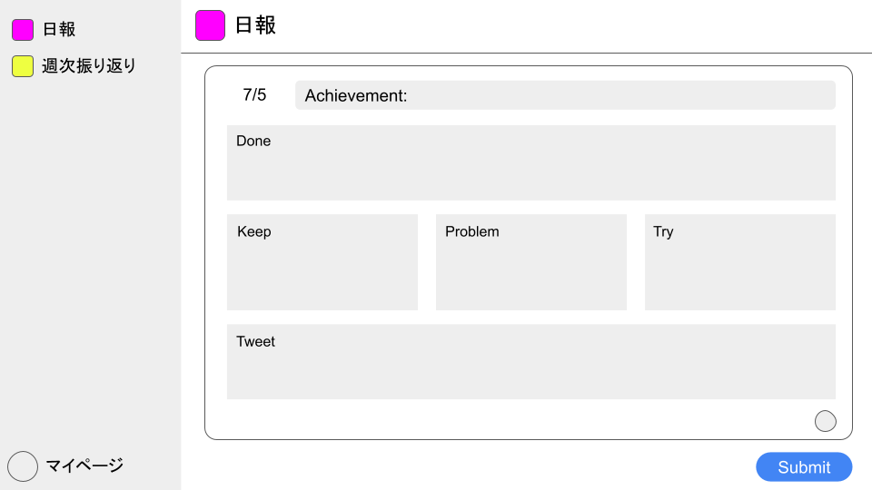
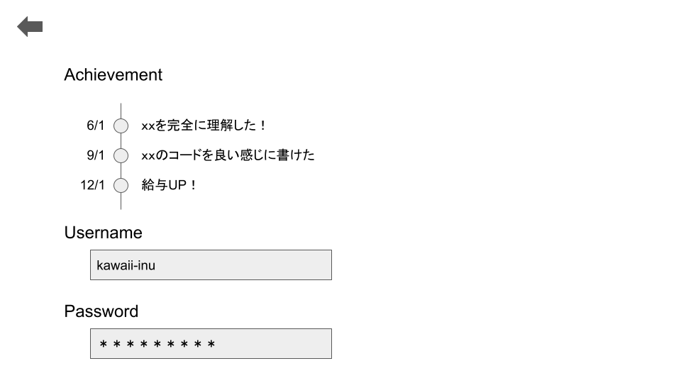

# 画面レイアウト

### ユーザー登録画面

| ラベル | 画面部品の種類 | 画面部品の説明 |
| ---- | ---- | ---- |
| username | テキストボックス | ユーザー名を入力するテキストボックス |
| password | テキストボックス | パスワードを入力するテキストボックス |
| Submit | ボタン | ユーザー登録処理を起動するボタン |

#### ユーザー登録に失敗した時
- モーダル表示で「ユーザー登録に失敗しました。他のusernameを登録してください」(仮)というメッセージを表示

### ログイン画面

| ラベル | 画面部品の種類 | 画面部品の説明 |
| ---- | ---- | ---- |
| username | テキストボックス | ユーザー名を入力するテキストボックス |
| password | テキストボックス | パスワードを入力するテキストボックス |
| Submit | ボタン | ログイン処理を起動するボタン |

#### ログインに失敗した時
- モーダル表示で「ログインに失敗しました。正しいusernameとpasswordを入力してください」(仮)というメッセージを表示

### 日報画面

| ラベル | 画面部品の種類 | 画面部品の説明 |
| ---- | ---- | ---- |
| Achivement | ラベル | アチーブメントの記入が null なら枠ごと表示させない |
| Done | ラベル | やったことの表示 |
| Keep | ラベル | Keep(よかったこと)の表示 |
| Problem | ラベル | Problem(悪かったこと)の表示 |
| Try | ラベル | Try(改善)の表示 |
| Tweet | ラベル | Tweet(ひとこと)の表示 |
| Edit(日報エリア内の左の〇) | ボタン | 投稿済みの日報の編集モーダルを起動するボタン |
| Delete(日報エリア内の右の〇) | ボタン | 投稿済みの日報の削除モーダルを起動するボタン |
| Add | ボタン | 新規日報の編集エリアを起動するボタン |
| MyPage | ボタン | マイページへの遷移を起動するボタン |

### 日報画面 (Add ボタン押下後)

| ラベル | 画面部品の種類 | 画面部品の説明 |
| ---- | ---- | ---- |
| Achivement | テキストボックス | アチーブメントの記入をするテキストボックス |
| Done | テキストボックス | やったことの記入をするテキストボックス |
| Keep | テキストボックス | Keep(よかったこと)の記入をするテキストボックス |
| Problem | テキストボックス | Problem(悪かったこと)の記入をするテキストボックス |
| Try | テキストボックス | Try(改善)の記入をするテキストボックス |
| Tweet | テキストボックス | Tweet(ひとこと)の記入をするテキストボックス |
| Delete(日報エリア内の〇) | ボタン | 編集中の日報の削除モーダルを起動するボタン |
| Submit | ボタン | 日報の新規追加を起動するボタン |
| MyPage | ボタン | マイページへの遷移を起動するボタン |

### マイページ画面

| ラベル | 画面部品の種類 | 画面部品の説明 |
| ---- | ---- | ---- |
| Achivement | ラベル | アチーブメントを表示 |
| Username | ラベル | ユーザー名を表示 |
| Password | ラベル | パスワードを伏字で表示 |
| Back(矢印) | ボタン | 日報ページへの遷移を起動するボタン |
