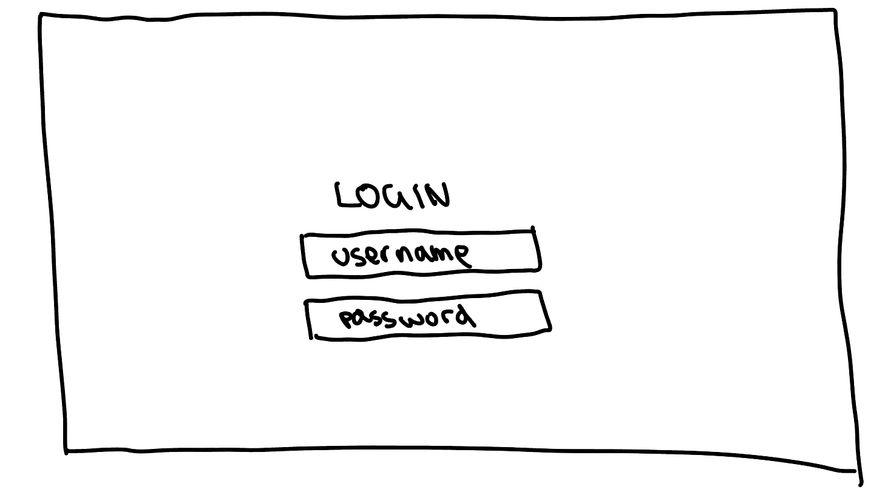
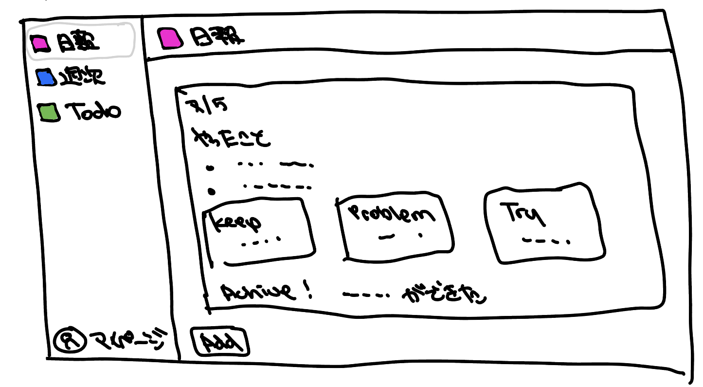
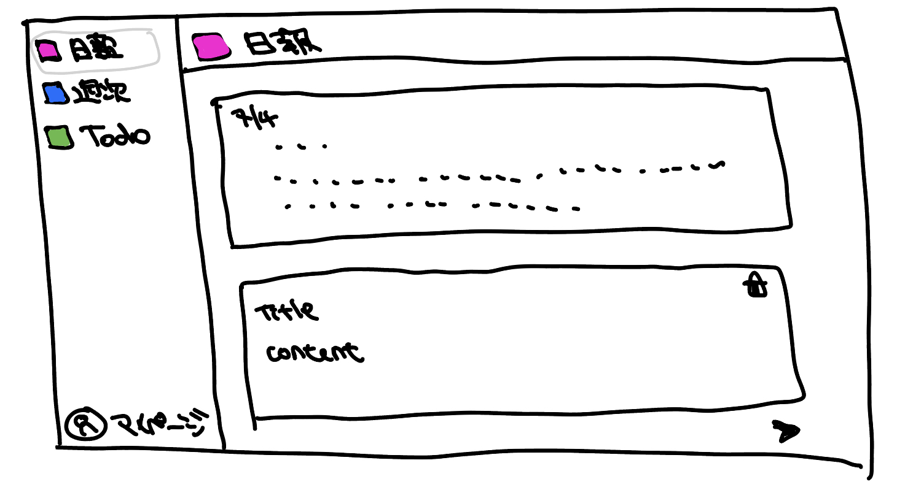
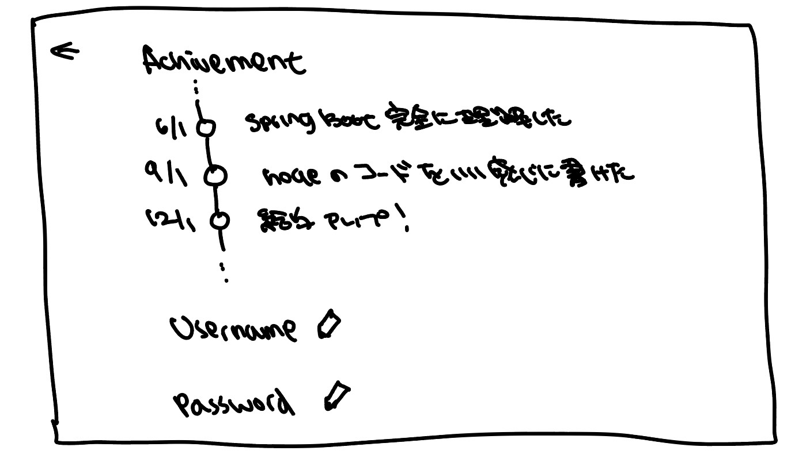

# システム全体像の明確化
### 画面一覧
- ログイン画面
- ユーザー登録画面
- 日報画面
- マイページ

### ログイン画面
#### イメージ

#### 要素
- ユーザーネーム記入欄
- パスワード記入欄
- 送信ボタン
- ユーザー登録ボタン

### ユーザー登録画面
#### イメージ
- ログイン画面と同じ感じ
#### 要素
^ ユーザーネーム記入欄
- パスワード記入欄
- 送信ボタン

### 日報画面のイメージ
#### イメージ
日報画面を開いた時

[Add]ボタンを押下した時

#### 要素
- 日報エリア
  - タイトル(=日付)
  - コンテントエリア
    - やったこと
    - KPTエリア
      - Keep
      - Problem
      - Try
    - アチーブメント
- [Add]ボタン
- [Delete]ボタン
- [Submit]ボタン

### マイページのイメージ
#### イメージ

#### 要素
- アチーブメント
- ユーザーネーム
- パスワード

### 今回実装しないこと
- ユーザーネーム、パスワードの変更