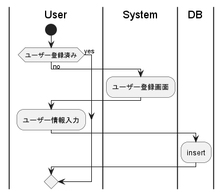
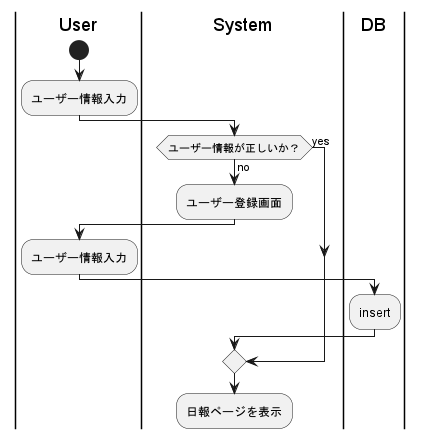
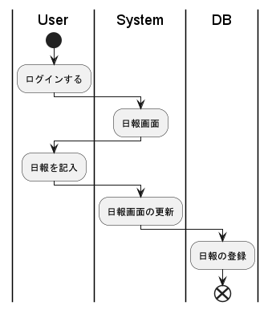
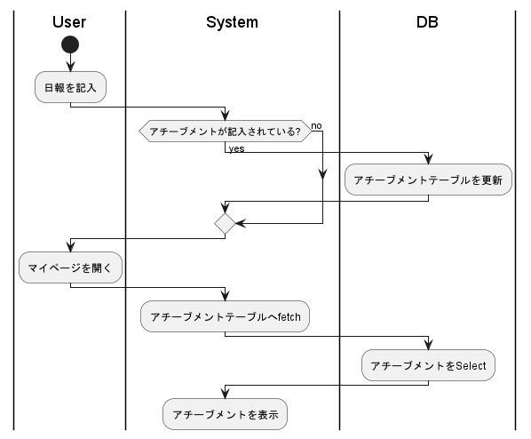

# 機能要件
### 機能一覧
- ユーザー登録
- ログイン
- 日報CRUD
- アチーブメント登録

### ユーザー登録

#### UMLには書いてないこと
- ユーザーネームが登録済みの時にはrejectする
  - できれば登録ボタンを押す前にブラウザで表示したい

### ログイン

### 日報CRUD

#### UMLには書いてないこと
- 編集と削除も同じ感じ
- 画面の更新はDB登録後の方がいいかも

### アチーブメント登録

#### UMLには書いてないこと
- アチーブメントの記入の有無にかかわらず、日報のDBへの登録はされる