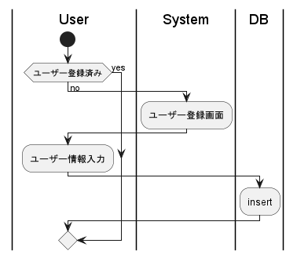
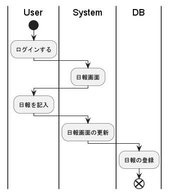

# 個人用日報アプリ 要件定義
### 目的
- 会社用の日報では事実ベースで書いているが、お気持ちベースで書く日報も欲しい
  - モヤモヤしたことがあった時、言語化する機会がほしい
  - 何を考えていたのか記録として残したい
  - 会社の日報に書くほどの成果じゃないけど自分的には嬉しい成果を成長記録として残したい
- 日報をtimesと所属部署のチャンネルの双方にアップしているが、フォーマットが違うのでフォーマットの書き換えがめんどくさい

### 概要
- 日報アプリ
  - 日報入力フォームは以下の要素を持つ
    - タイトル
    - コンテントエリア
      - やったこと
      - KPTエリア
        - Keep
        - Problem
        - Try
    - アチーブメント
  - 日報投稿用フォーマッター
    - フォーマット登録
    - フォーマットされたテキストの生成
    - コピーボタン
- 特徴
  - アチーブメント機能つき
  - 日報投稿用フォーマッター
### 機能要件
#### 機能一覧
- ユーザー登録
- ログイン
- 日報CRUD
- アチーブメント登録
- 日報投稿用フォーマッター

#### ユーザー登録

##### UMLには書いてないこと
- ユーザーネームが登録済みの時にはrejectする
  - できれば登録ボタンを押す前にブラウザで表示したい

#### ログイン

#### 日報CRUD

##### UMLには書いてないこと
- 編集と削除も同じ感じ
- 画面の更新はDB登録後の方がいいかも

#### アチーブメント登録

##### UMLには書いてないこと
- アチーブメントの記入の有無にかかわらず、日報のDBへの登録はされる

#### 日報投稿用フォーマッター

### 非機能要件
基本的に今回はスコープ外。
- 可用性
  - 今回のスコープ外とする
- 性能
  - 今回のスコープ外とする。一回作ったらパフォーマンス向上に取り組む
- 運用
  - 今回のスコープ外とする。AWSでデプロイできたらいいな
- 移行性
  - 今回のスコープ外とする。今回は拡張性を意識してコードを書くだけ
- セキュリティ
  - 今回のスコープ外とする
- 環境・エコロジー
  - 今回のスコープ外とする

### 開発ラフスケジュール
- なるはや。個人開発なので気合い。
- 2023年 ~~7月中~~ に機能を一通り作れるように頑張る
  - デザインはカスでもOK
- 最悪2023年内完成

### 見積もり・予算
- 全行程個人開発なのでタダ